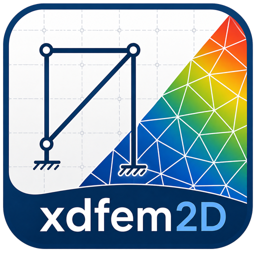

<p align="center">
  
</p>

<h1 align="center">xdfem2D</h1>

<p align="center">
  2D finite-element structural analysis — frames, walls, slabs and grillages:
  a Python FEM library (<code>xdfem2d</code>) paired with a PySide6 desktop
  application.<br>
  Units throughout: <b>kN · m · kNm</b>.
</p>

<p align="center">
  <a href="https://github.com/pcachim/xdfem2D/releases"></a>
  <a href="https://pypi.org/project/xdfem2d/"></a>
</p>

<p align="center">
  The app and the engine are versioned and released independently — the
  badges above always show the current number of each. To see exactly which
  engine version a given app build was compiled against, open
  <b>Help → About</b> in the app: it lists both.
</p>

---

## Two domains, one model type

Every model is either **plane** (a frame or wall in its own plane) or **plate**
(a slab or grillage bending out of plane) — chosen once, in **New model**, and
fixed for the model's life. The two domains share the same solver machinery but
give different meaning to supports, loads and results element by element. See
[Domains](https://pcachim.github.io/xdfem2D/domains.html) for the full
comparison.

## Features

### Modelling & elements

- **Plane**: Euler–Bernoulli beam–column elements (full 6-DOF, 3 per node) and
  membrane triangles for walls/panels — **CST**, **Allman**, and **ES-FEM**
  formulations — with automatic Delaunay meshing of polygon surfaces (built-in
  mesher).Quadrilateral membrane elements (**QM6**,
  **Q4**) are also available.
- **Plate**: grillage beams (bending + St-Venant torsion) and plate-bending
  triangles — **MITC3** (shear-deformable, thin and thick slabs) and **DKT**
  (thin-plate); quadrilateral plate elements (**MITC4**, **DKT4**) as well.
- Pinned, roller, fixed, guided, and rotational supports (plane) or their
  plate equivalents — simple, clamped, symmetry (plate)
- Node springs (Kx/Ky/Kt) and element foundation (Winkler) springs, including
  tension-only / compression-only (unilateral) springs; area (Winkler) springs
  for slabs on grade
- Multi-point **constraints**
- Parametric geometry objects (arcs, polylines, rectangles, polygons) that
  auto-resolve T-junctions and crossings when the model is analysed
- Automatic topology checks: isolated nodes, coincident nodes, unconnected
  junctions/crossings, duplicate bars

### Loads & analysis

- Point loads, trapezoidal distributed loads (global or local axes), thermal
  loads, support settlements, nodal masses, and self-weight by load-case
  factor; area pressure and Winkler area springs for slabs (plate domain)
- A three-tier model — **load cases** (define loads) → **analysis cases**
  (solve them) → **combinations** (combine analysis cases) — mirroring the
  convention used by mainstream structural software
- Analysis types: Linear, NonLinear (unilateral springs, active-set
  iteration), Mass, Modal (eigenvalue), Response Spectrum (EC8), and
  Geometric Nonlinear (P-Delta) — the last two in the plane domain
- Load combinations: linear, envelope (max/min), SRSS, and automatic
  Eurocode (EN 1990) combination generation

### Structural design

- **Concrete — EN 1992-1-1 (EC2)**: reinforcement design (flexure + shear)
  for rectangular bar sections, membrane (Wood/Baumann) reinforcement of
  concrete triangles, EC2 crack-width (SLS) verification, and punching shear
- **Steel — EN 1993-1-1 (EC3)**: cross-section resistance and member
  buckling checks (I, RHS/SHS, CHS profiles), with automatic physical-member
  buckling lengths
- **Timber — EN 1995-1-1 (EC5)**: ULS member checks, with the same
  physical-member buckling lengths as steel
- **Slabs**: Wood–Armer design moments reported per triangle, ready for an
  EC2 slab check
- **EC8** seismic response spectra (elastic and design)
- A step-by-step **Design report** (HTML/PDF/Word/Markdown), with the code
  clause, symbolic expression and numeric substitution for every check

### Variants, phasing & interoperability

- **Variants**: parallel what-if scenarios over a shared model, combined with
  the same arithmetic as load combinations
- **Construction phasing / sequencing**: incremental analysis carrying
  forward locked-in internal forces from earlier phases
- Import a second model into a shared entity space, welding coincident nodes
  automatically (the shared foundation behind variants and phasing)
- Import/export **DXF** drawings, import/export **SAP2000** (`.s2k`),
  import/export **IFC** (openBIM structural-analysis model), and export to
  **Autodesk Robot** (`.str`)

### AI Assistant (optional)

- An **AI panel** answers questions about the open model in plain language —
  local by default via [Ollama](https://ollama.com), or a remote provider
  (OpenAI, Google Gemini, DeepSeek, and others) with your own API key
- Can propose a **new model** (a small beam/wall/slab/grillage template) or a
  Python build script from a plain-language request, for review before use
- See [The AI Assistant](https://pcachim.github.io/xdfem2D/assistant.html)

### Interface & results

- Interactive canvas: cursor-anchored zoom, pan, window selection, hover
  tooltips, and named **Scenes** (saved working subsets of the model)
- Parametric **templates** across six families — Beams & Frames, Slabs,
  Walls, Trusses, Grillages, Arches — to start a model in seconds
- Configurable colour maps, diagram/utilisation-ratio styling, and
  savable/loadable visualisation style presets
- Results: displacements, reactions, element end-forces, N/V/M diagrams,
  deformed and modal shapes, membrane stresses / slab moments, cut
  resultants, and reaction sums
- Exports: drawing (PNG/SVG/PDF), a formatted PDF/Word/Excel results report,
  an Excel workbook (model or results), and Word reports
- Save/load structures as `.x2d` (default, includes results) or `.json`
  (structure only)

---

## Download the desktop app

Prebuilt, no-install-needed apps for **macOS, Windows and Linux** are published
on every release at [github.com/pcachim/xdfem2D/releases](https://github.com/pcachim/xdfem2D/releases).
Opening a `.x2d` file from your file browser launches the app directly.

Full documentation (also built from this repo) is published at
[pcachim.github.io/xdfem2D](https://pcachim.github.io/xdfem2D/).

---

## Graphical Interface

### Layout

| Area | Contents |
|---|---|
| Left panel — **Geometry** | Nodes · Elements · Supports · Springs · Constraints |
| Left panel — **Properties** | Materials · Sections |
| Left panel — **Loads** | Loads · Analysis Cases · Combinations |
| Left panel — **Analysis** | Results / Design |
| Right | Structure canvas |

On-demand workbench tabs (Punching, Buckling lengths, Cuts, Design report) open
beside the tables/assistant panel when needed.

### Toolbar

| Control | Description |
|---|---|
| ▶ Run (F5) | Run FEM analysis and save results |
| 🔒 Lock / 🔓 Unlock (Ctrl+L) | Lock model after analysis / unlock to edit |
| View | Switch canvas display: Structure · Deformed · M · V · N · Reactions · Modal · … |
| Case | Select load case or combination to display |
| Scene | Switch to a named working subset of the model, or the full model |
| Scale | Deformation scale multiplier (e.g. 100 × real), with an Auto option |

A coloured **domain badge** (blue Plane / green Plate) shows which domain the
open model uses.

### Keyboard shortcuts

| Key | Action |
|---|---|
| Ctrl+N | New model |
| Ctrl+T | New from template |
| Ctrl+O | Open file |
| Ctrl+S | Save |
| Ctrl+Shift+S | Save As |
| Ctrl+Shift+W | Write Report (PDF/Word/Excel) |
| Ctrl+Shift+T | Write Tables to Excel |
| Ctrl+E | Print graphics |
| F5 | Run analysis |
| F6 | Generate mesh |
| Ctrl+L | Toggle lock |
| Ctrl+1 … Ctrl+9 | Switch view mode (Structure … Reinforcement) |
| F9 | Show/hide tables panel |
| Ctrl+F | Find object |
| F1 | Open documentation |

Full list (incl. Edit/View/Canvas shortcuts): **Help → Keyboard Shortcuts** in
the app, or [Keyboard Shortcuts](https://pcachim.github.io/xdfem2D/shortcuts.html) online.

### Canvas interaction

- **Hover** over a node or element to see its properties as a tooltip
- **Click** a node to edit geometry, support, and node spring
- **Click** an element to edit connectivity, section, and foundation spring

### File formats

| Extension | Description |
|---|---|
| `.x2d` | ZIP containing `structure.json` + `results.json` (+ view state) — default format |
| `.json` | Structure definition only (no results) |

Analysis results can additionally be exported to `.json`, `.xlsx`, or a
PDF/Word report; the model alone can be exported to `.xlsx`, DXF, SAP2000
(`.s2k`), IFC, Robot (`.str`), or a Python build script — see
[Exporting](https://pcachim.github.io/xdfem2D/exporting.html).

After every successful analysis the `.x2d` file is saved automatically.
Opening a `.x2d` that contains results restores them and locks the model.

---

## Python API

```python
from xdfem2d import Structure2D

struc = Structure2D()  # domain="plane" by default; domain="plate" for slabs/grillages

# Nodes
struc.add_node('N1', 0.0, 0.0)
struc.add_node('N2', 0.0, 4.0)
struc.add_node('N3', 6.0, 4.0)
struc.add_node('N4', 6.0, 0.0)

# Material and cross-section
struc.add_material('C25', elastic_modulus=30e6, unit_weight=25.0)
struc.add_section('COL', material_name='C25', b=0.3, h=0.3)
struc.add_section('BM',  material_name='C25', b=0.25, h=0.5)

# Elements
struc.add_bar_element('E1', 'N1', 'N2', 'COL')   # left column
struc.add_bar_element('E2', 'N2', 'N3', 'BM')    # beam
struc.add_bar_element('E3', 'N4', 'N3', 'COL')   # right column

# Supports
struc.add_support('FIXED', ux=True, uy=True, tz=True)
struc.assign_support('N1', 'FIXED')
struc.assign_support('N4', 'FIXED')

# Loads
struc.add_load_case('SW', self_weight_factor=1.0)
struc.add_load_case('LL')
struc.add_distributed_load('E2', 'LL', fye=-15.0, fyd=-15.0)   # 15 kN/m down
struc.add_point_load('N2', 'LL', fx=10.0)                       # 10 kN horizontal

# Combination
struc.add_load_combination('ULS', coefficients={'SW': 1.35, 'LL': 1.5})

# Solve
results = struc.calculate()

# Displacements
for nid, d in results['displacements']['LL'].items():
    print(f"{nid}: ux={d[0]:.6f} m  uy={d[1]:.6f} m  rz={d[2]:.6f} rad")

# Reactions
for nid, r in results['reactions']['LL'].items():
    print(f"{nid}: Rx={r[0]:.3f} kN  Ry={r[1]:.3f} kN  Mz={r[2]:.3f} kNm")

# Save / load
struc.save('portal.json')
struc2 = Structure2D.load('portal.json')
```

### Export helpers

```python
from xdfem2d import save_structure_json, load_structure_json
from xdfem2d.results_io import save_json, save_excel

save_json(results,  'results.json')
save_excel(results, 'results.xlsx')
```

### Structural design (EC2 / EC3 / EC5)

```python
from xdfem2d import design_reinforcement          # concrete members (EC2)
from xdfem2d.steel_design import design_steel_members    # steel members (EC3)
from xdfem2d.timber_design import design_timber_members  # timber members (EC5)

struc.bar_elements_by_id['E2'].rc_design = True
struc.bar_elements_by_id['E2'].rc_cover   = 0.03   # m

struc.add_concrete_material(
    'C25', concrete_class='C25/30', steel_class='A500',
    gamma_c=1.5, gamma_s=1.15, alpha_cc=1.0)

results = struc.calculate()
rc = design_reinforcement(struc, results)

for elem_id, cases in rc.items():
    for case_id, r in cases.items():
        print(f"{elem_id} / {case_id}: "
              f"As_bot={r.As_bot*1e4:.2f} cm²  "
              f"As_top={r.As_top*1e4:.2f} cm²  "
              f"Asw/s={r.Asw_s*1e4:.2f} cm²/m")
```

### Model utilities

```python
from xdfem2d import model_check, model_to_python, check_script

issues = model_check(struc)          # topology / consistency checks
source = model_to_python(struc)      # write the model back out as a Python build script
problems = check_script(source)      # check a build script without running it
```

### Variants and construction phasing

```python
from xdfem2d import solve_variants, combine_across_variants
from xdfem2d.workflows import run_sequence

# Variants: independent what-if overlays on the same base model
variant_results = solve_variants(struc, variants)
combined = combine_across_variants(variant_results, terms)

# Construction phasing: incremental analysis carrying forward locked-in forces
phase_results = run_sequence(struc, sequence)
```

### Interoperability

```python
from xdfem2d.dxf_io import load_dxf, save_dxf
from xdfem2d.sap2000_io import save_s2k, load_s2k
from xdfem2d.robot_io import save_str
from xdfem2d.ifc_io import save_ifc, load_ifc   # needs the 'ifc' extra
```

## Sample file

`examples/example_2level_2bay_full.x2d` — a two-level, two-bay frame ready to
open in the GUI, with a solved model and results included.

---

## License

xdfem2D, the desktop application, is **freeware**: free to download and use, but distributed only as a compiled application,
without redistribution or modification rights. See [LICENSE.md](LICENSE.md)
for the full terms, including the "as is" / no-warranty disclaimer.

The app is built on two open-source libraries, each published and licensed
separately:

| Component | What it does | License |
|---|---|---|
| [xdfem2d](https://github.com/pcachim/xdfem2D) | The 2D finite-element calculation engine at the core of the app — frames, walls, plates/slabs and grillages, load cases and combinations, modal and response-spectrum analysis, and EC2/EC3/EC5 design. Also on PyPI (`pip install xdfem2d`). | LGPLv3 — [LICENSE-engine.md](LICENSE-engine.md) |
| [eurocodepy](https://github.com/pcachim/eurocodepy) | Eurocode material databases and design checks (concrete, steel, timber) used by the engine for reinforced-concrete, steel and timber design. | LGPLv3 |

The LGPLv3 allows both libraries to be embedded in xdfem2D's freeware
distribution while keeping them free software: you may obtain, modify and
relink either one, independently of the app, under its own LGPLv3 terms.

See [NOTICE.md](NOTICE.md) for the full list of third-party components
bundled in the app, including Qt/PySide6 (also LGPLv3).
